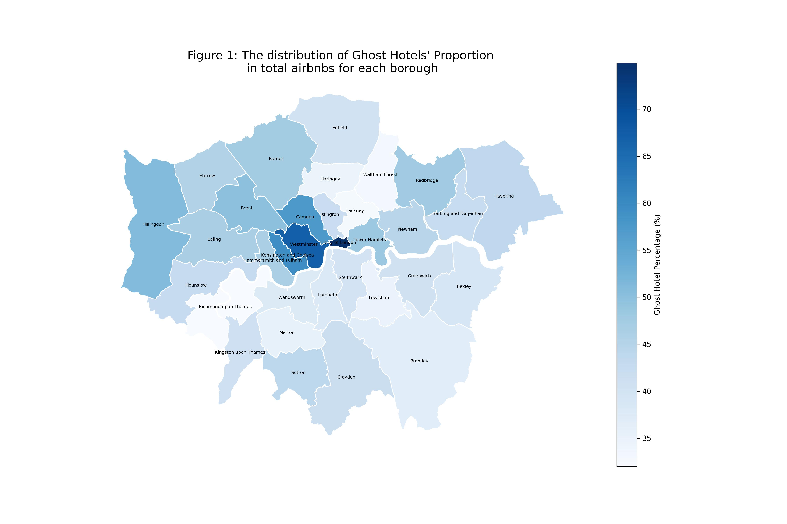
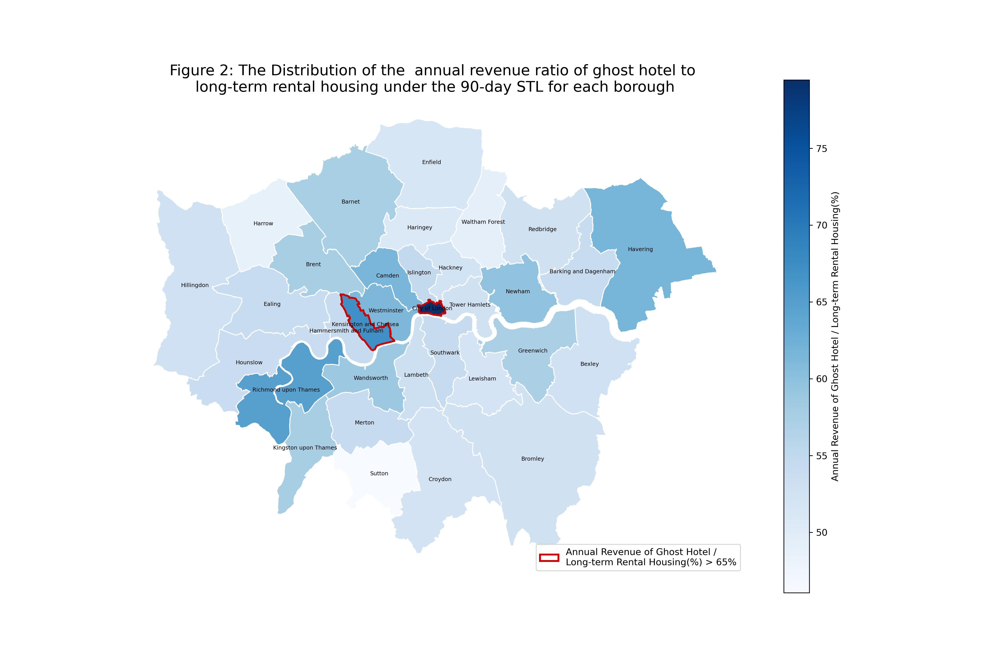
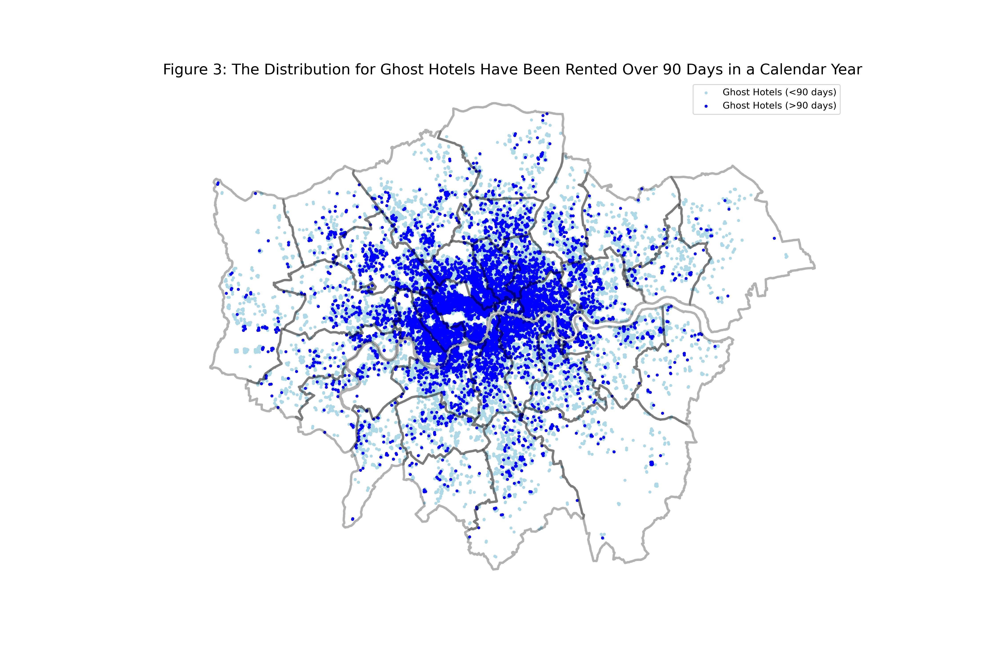

# The Commercialisation and Regulatory Dilemmas of London's Short-Term Rental Market: An Analysis Based on InsideAirbnb Data

UCL-CASA0013空间数据科学基础（Foundations of Spatial Data Science）Group Project —— 获得**DISTINCTION**评级)	
{: .text-red-300}

## 主要内容

**这份小组报告围绕 [InsideAirbnb](https://insideairbnb.com/explore/) 数据的收集、质量、伦理问题，以及对伦敦短租（STL, Short-Term Lets）监管的“90天”条例的合理性的论证，回答了7个核心问题，成果可以用于Airbnb平台规则优化依据、伦敦住房管理部门监管平台方的依据，主要内容总结如下：** 

### 1. 数据收集者与目的

数据由 Murray Cox 团队（InsideAirbnb项目）采集，目的是弥补 **Airbnb** 缺乏透明度和公共责任的问题，帮助社区理解短租对住房的影响。

### 2. 数据收集方法

- 采用网页爬虫抓取**Airbnb**公布的公开数据（房源页面、房东 ID、日历信息等）。

- 数据准确率与**Airbnb**官方发布数据相差 3–6%，可信度较高。

- 存在缺陷：无法获取内部指标（入住率、实际预订晚数）、地理位置模糊化（误差 0–450 英尺）、隐藏或下架房源缺失。

### 3. 伦理考量

- **隐私问题**：房东数据被长期保存，可能违反 GDPR 的“被遗忘权”。

- **同意问题**：用户在 **Airbnb** 上公开数据并不等于同意其被二次研究使用。

- **偏差问题**：数据集中于发达国家与大城市，忽视全球南方与小城市。

### 4. Airbnb 伦敦市场特征

- **商业化趋势明显**：仅 2.9% 的房东（1652 人）控制了 27% 的房源（26060 套）。

- **Ghost Hotels（幽灵酒店）问题**：通过 **NLP 文本相似度（>=50%）** + **地理邻近度分析(房源之间距离在200m以内)**，发现约**43,584**套房源(**40%房源**)可能是“幽灵酒店”，由专业运营商而非个人房东管理。

- “幽灵酒店”集中在伦敦市中心（City of London、Westminster、Camden 等）。
  

### 5. “90天”条例监管效力评估

- 英国 1973 年法案要求 STL 需规划许可，2015 年 Deregulation Act 放宽至 ‘90天’ 规则（无需许可），**Airbnb** 自 2017 年起自动执行。

- 报告通过“年收入对比模型”来评估 '90 天限制' 规则有效性：
  
  - 幽灵酒店的年收入仍可达长期租赁收入的 55%。
  
  - 在 Kensington and Chelsea、City of London 等地甚至高达 67–79%，削弱了 90 天规则的威慑力。

- 还发现有 **10,989** 套房源滥用 ‘90天限制’（超额出租），多数为整套住房，由少数管理公司集中操纵。

## 重点发现

- 伦敦 Airbnb 高度商业化：40% 房源疑似幽灵酒店，集中在市中心。

- 监管失效：‘90天’规则在多数区不足以抑制商业化短租，因为STL的收入仍然可观。

- 滥用普遍：超过 1 万套房源超额出租，主要由专业管理公司操作。

- 政策建议：
  
  - 需对不同行政区（Borough）设置差异化限制；

  - 针对管理公司与整套房源强化审核；

  - 调整 ‘90天’规则，使 STL 收益显著低于 LTL 才能发挥作用。

## 方法论
- 数据分析方法：

  - 使用 InsideAirbnb 数据，计算房源规模、房东持有量比例。

  - 利用 文本 NLP 相似度（>0.5）识别描述内容重复的房源。

  - 结合 地理邻近性（<200m）判断“幽灵酒店”。

- 长/短租金计算模型：
  
  - 基于 价格 × 90 天 估算 STL 收益。

  - 结合 VOA（Valuation Office Agency）长期租赁租金，计算 STL 与 LTL 收入比例。

- 政策效果评估

  - 使用 50% 评论率模型 估算预订晚数，判断是否违规超 90 天。

  - 比较各区 STL 与 LTL 收入差异，提出差异化监管建议。

## 总结

通过 InsideAirbnb 数据分析 + NLP 文本挖掘 + 收入模型 揭示了伦敦 Airbnb 市场的 商业化、幽灵酒店扩张、监管不足 等核心问题。其贡献在于将数据驱动的证据与政策讨论结合，为短租监管提供了明确的方向。
