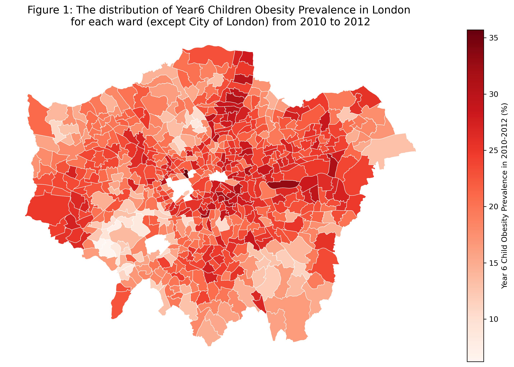
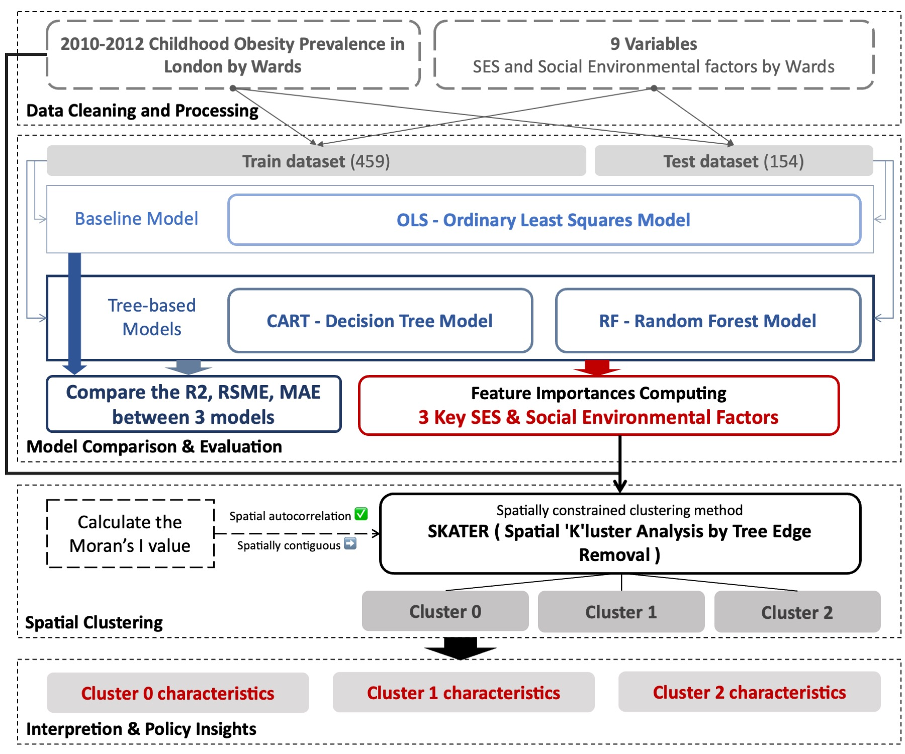
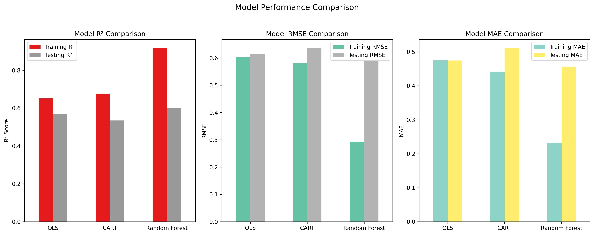

# Childhood Obesity and Spatial Inequalities in London: From Socioeconomic Determinants to Spatial Clustering

UCL-CASA0007定量方法(Quantitative Methods)Coursework Project and CASA0006空间系统数据科学（Data Science for Spatial Systems）Coursework Project—— 获得**DISTINCTION**评级	
{: .text-delta .text-red-300}

## 主要内容

本研究聚焦伦敦儿童肥胖率的空间不平等问题，以2010–2012年街区ward层级的儿童肥胖率数据为核心，结合社会经济、社会环境和城市环境等多维因素，探讨以下问题：

- 哪些社会经济与环境因素最显著地影响儿童肥胖？

- 儿童肥胖率与这些因素的关系是线性的，还是存在非线性复杂性？

- 肥胖率及其决定因素是否在空间上表现出显著聚集和分异？

研究旨在揭示儿童肥胖背后的社会不平等机制，并探索其空间化格局，为公共卫生与城市规划提供政策参考。

## 方法论

### 数据与变量

因变量：伦敦 Year 6 儿童肥胖率（ward 层级）。

自变量：涵盖 社会经济因素（贫困率、收入、失业率、教育水平）、社会环境因素（缺勤率、犯罪率、健康状况）、城市环境因素（人口密度、绿地可达性、交通可达性）。

### 统计建模

多元线性回归（OLS）：作为基准，检验线性关系。

变量筛选：基于显著性（p value）、多重共线性检测（VIF）。

### 机器学习方法

OLS 作为基准，对比CART（决策树回归）、Random Forest（随机森林）模型拟合结果。

评估指标：R²、RMSE、MAE。

特征重要性分析，识别关键驱动因素。

### 空间分析

Moran’s I：检验肥胖率的空间自相关性。

SKATER 聚类：结合肥胖率和关键社会经济变量，识别伦敦 ward 的空间分区与不平等模式。

## 主要发现

- 线性关系占主导

  - OLS 表现稳健（R²≈0.64），能够解释大部分儿童肥胖率的差异。

  - 儿童肥胖率与 贫困率、缺勤率、犯罪率、人口密度正相关；与教育水平、绿地可达性负相关。

- 非线性模型提供补充

  - CART 泛化能力不足。

  - Random Forest 在测试集上表现略优于 OLS，揭示了关系中的非线性细节，但提升有限。

  - 特征重要性结果显示 儿童贫困率最为关键，其次是家庭收入、失业率。

- 空间格局显著

  - Moran’s I ≈ 0.51，说明儿童肥胖率在伦敦存在显著空间聚集。

  - SKATER 聚类识别出典型高风险区域：高贫困、高失业、低收入的 ward 与高肥胖率紧密耦合。

.jpg)

- 政策启示

  - 需要差异化干预：重点关注贫困率高、人口密度大、绿地匮乏的区域。

  - 教育和社会资源提升是长期关键路径。

  - 城市规划应加强 绿地和公共活动空间的均衡分布，以缓解空间不平等。

