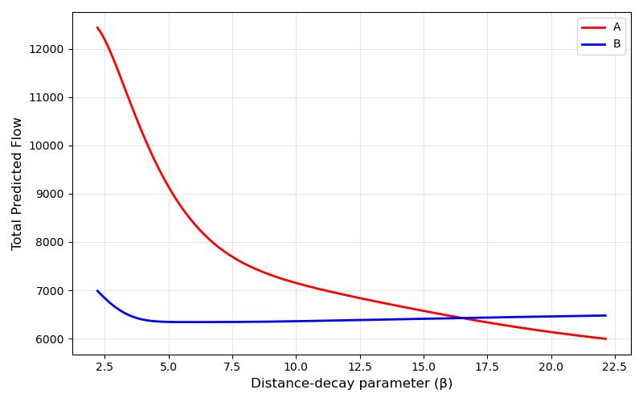

# Urban Simulation - London Underground Resilience and Retail Network Analysis

UCL-CASA0002城市建模（Urban Simulation）Coursework Project —— 获得**DISTINCTION A+**评级	
{: .text-delta .text-red-300}

## 地铁枢纽节点对城市出行的价值与风险

### 主要内容

- 项目以伦敦地铁网络为研究对象，评估哪些车站对整体交通运行至关重要。

- 通过对乘客流量与站点连接关系的分析，识别出一批高风险、高价值的关键车站。

- 同时模拟了当‘Waterloo’等主要地铁站临时关闭，对出行人次和可替代路线的影响。

### 主要发现

- Stratford、Waterloo、King’s Cross 等车站是最高价值的交通节点，任何停运都会大规模影响通勤效率。

- Waterloo 单站关闭就会影响 超过 9 万人次 的日常出行。

- 最优替代站点包括 Lambeth North 和 Southwark，步行 10 分钟左右可达。

- 对运营方来说，应重点关注这些站点的 风险管理（安全、维护、备用通道），并优先保障其运行稳定性。

### 方法论 

- 中心性分析：

  Degree → 衡量车站直连程度。

  Closeness → 衡量车站到其他节点的平均最短路径。

  Betweenness → 衡量车站在最短路径中充当“桥梁”的频率。

- 韧性评估： 按照中心性排名移除节点，观察 LCC 大小变化。

- 加权分析：

  将客流量作为边权值，引入 **Dijkstra 算法** 重新计算中心性。

  分析主要人流（OD），模拟 Waterloo 站关闭时的影响，并基于 OSMnx包，计算步行可达的替代车站。

## 零售网络布局与新店选址决策

基于人口与可达性的超市选址模拟

### 主要内容

- 项目模拟了伦敦两个潜在新超市选址（A 和 B）的市场吸引力。

- 结合社区人口分布、商店面积以及交通成本，预测每个选址可吸引的客流量。

- 进一步评估了不同交通成本情景（如出行价格上涨）对消费者购物行为的影响。

## 主要发现

- **选址A**的潜在客流量（12,433 人）几乎是**选址B**的两倍（6,976 人），是更优的投资选址。

- 即使在交通成本大幅上涨的极端情况下，**A**仍保持明显优势。

横轴 (x-axis)： Distance-decay parameter (β)，表示距离衰减系数。数值越大，消费者越不愿意为购物而长距离出行。{: .fs-3 .text-delta .text-grey-dk-000}

纵轴 (y-axis)： Total Predicted Flow，总预测客流量，即模型估算的顾客去某个超市选址的总流量。{: .fs-3 .text-delta .text-grey-dk-000}

曲线：红色 (A 点)：候选选址 A 的预测客流量随 β 的变化情况;蓝色 (B 点)：候选选址 B 的预测客流量随 β 的变化情况。{: .fs-3 .text-delta .text-grey-dk-000}

｜在低 β 值（出行阻力较低时）：A吸引力远高于B，总流量超过12,000，几乎是B的两倍。说明在交通便利、出行成本低的情况下，A 是明显更优的选址。{: .fs-3 .text-delta .text-grey-dk-000}

｜随着 β 增大（出行阻力上升）：A的客流量快速下降，逐渐接近B水平。B的曲线相对平缓，受 β 影响较小，说明B吸引力更稳定但整体水平较低。{: .fs-3 .text-delta .text-grey-dk-000}

｜交叉点（大约 β ≈16.5左右）：当出行成本极高时，B 的流量开始略高于A。但这种情况只有在极端的交通/出行限制情境下才会发生。{: .fs-3 .text-delta .text-grey-dk-000}

- 目前约**23万**居民在15分钟步行范围内能够到达至少一家超市，显示伦敦居民对本地零售点的高度依赖。

- 投资方应优先考虑**A**作为新店选址，并结合步行可达性优化营销与服务布局。

### 方法论

- 模型选择：

  生产约束模型，适用于已知人口与目的地容量（面积），但缺乏实际流量数据的情况。

  参数 γ=2.0440（目的地吸引力弹性）、β=2.2140（距离衰减系数），借用课程实操校准结果。

- 模拟与场景分析：

  分别将 A 与 B 加入模型计算总流量。

  通过调节 β 值，测试当交通成本变化时，A 与 B 吸引力的敏感性。

  使用OSMnx网络分析计算15分钟步行可达人口。

